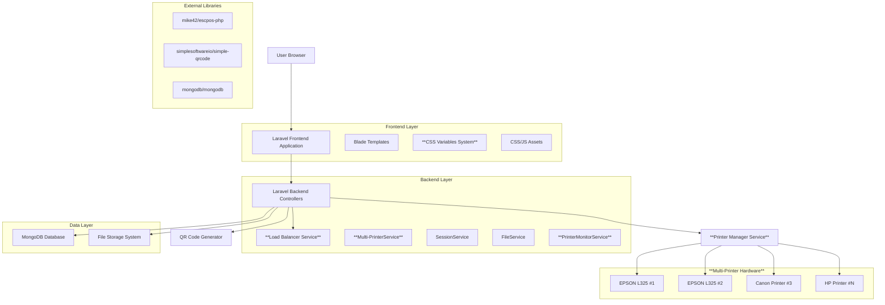
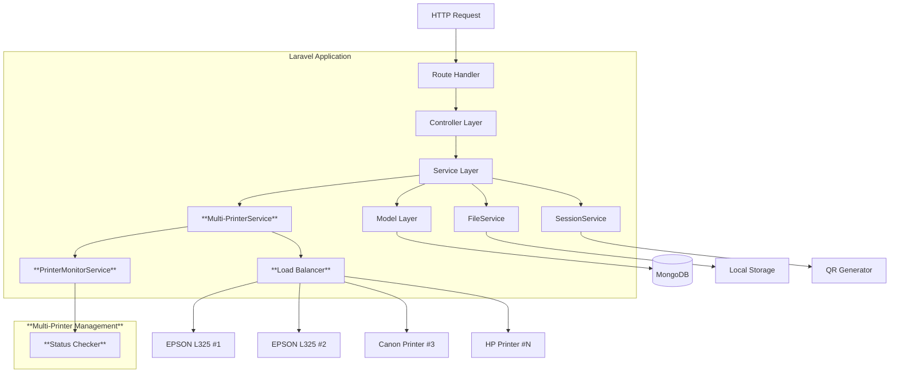
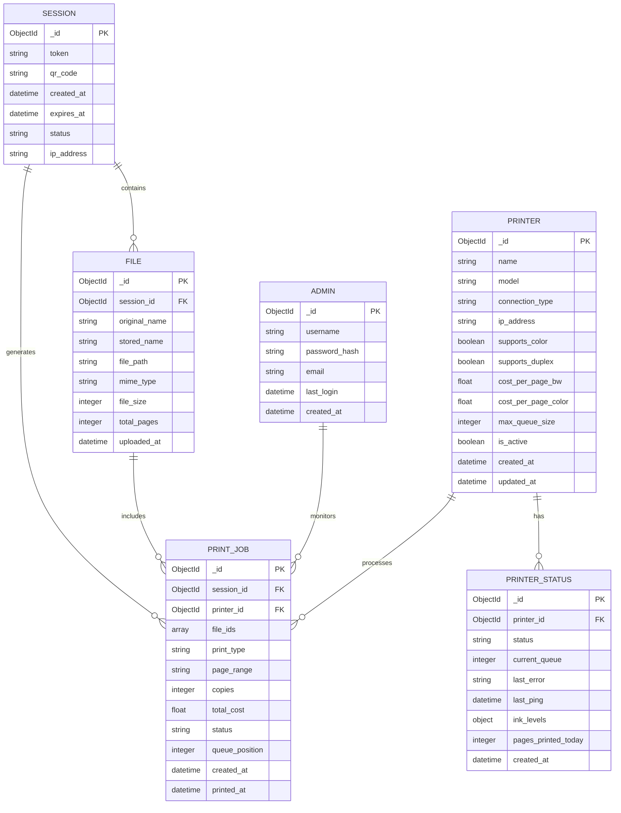

# Arquitectura Técnica - Imprimeindo Sistema de Impresiones Multi-Impresora

## 1. Architecture design



## 2. Technology Description

* **Frontend**: Laravel 11.x + Blade Templates + **TailwindCSS con Variables CSS Centralizadas** + Alpine.js

* **Backend**: Laravel 11.x + PHP 8.2+ + **Sistema Multi-Impresora**

* **Database**: MongoDB 7.0+ con **colección de impresoras**

* **Printer Integration**: mike42/escpos-php + **Gestor Multi-Impresora**

* **QR Generation**: simplesoftwareio/simple-qrcode

* **File Processing**: Laravel Storage + PDF/DOCX libraries

* **Load Balancing**: **Algoritmo de distribución de carga personalizado**

* **CSS System**: **Variables CSS centralizadas en resources/css/variables.css**

## 3. Route definitions

| Route            | Purpose                                                                    |
| ---------------- | -------------------------------------------------------------------------- |
| /                | Página principal con generación de QR y **estado de múltiples impresoras** |
| /session/{token} | Página de sesión única para usuario temporal                               |
| /upload          | Endpoint para subida de archivos múltiples                                 |
| /printers        | **Nueva ruta: Lista de impresoras disponibles para selección**             |
| /configure       | Página de configuración de parámetros de impresión **por impresora**       |
| /summary         | Página de resumen y confirmación de costos **con impresora asignada**      |
| /print           | Endpoint para procesamiento de impresión **con balanceador de carga**      |
| /admin/login     | Página de autenticación administrativa                                     |
| /admin/dashboard | Panel principal de administración **con estadísticas multi-impresora**     |
| /admin/printers  | **Nueva ruta: Gestión completa del parque de impresoras**                  |
| /admin/sessions  | Gestión de sesiones activas                                                |
| /admin/history   | Historial de impresiones realizadas **filtrado por impresora**             |
| /admin/settings  | Configuración del sistema **incluyendo múltiples impresoras**              |

## 4. API definitions

### 4.1 Core API

**Generación de sesión QR**

```
POST /api/session/generate
```

Response:

| Param Name              | Param Type | Description                         |
| ----------------------- | ---------- | ----------------------------------- |
| token                   | string     | Token único de sesión               |
| qr\_code                | string     | Código QR en base64                 |
| expires\_at             | datetime   | Fecha de expiración                 |
| **available\_printers** | **array**  | **Lista de impresoras disponibles** |

**\[NUEVA] Lista de impresoras disponibles**

```
GET /api/printers/available
```

Response:

| Param Name           | Param Type  | Description                                      |
| -------------------- | ----------- | ------------------------------------------------ |
| **printers**         | **array**   | **Lista de impresoras con estado y capacidades** |
| **total\_available** | **integer** | **Número de impresoras disponibles**             |

**Subida de archivos**

```
POST /api/files/upload
```

Request:

| Param Name      | Param Type | isRequired | Description                              |
| --------------- | ---------- | ---------- | ---------------------------------------- |
| session\_token  | string     | true       | Token de sesión válido                   |
| files           | file\[]    | true       | Archivos PDF/DOCX                        |
| **printer\_id** | **string** | **false**  | **ID de impresora preferida (opcional)** |

Response:

| Param Name             | Param Type | Description                           |
| ---------------------- | ---------- | ------------------------------------- |
| files                  | array      | Lista de archivos procesados          |
| total\_pages           | integer    | Total de páginas detectadas           |
| **suggested\_printer** | **string** | **Impresora sugerida por el sistema** |

**Configuración de impresión**

```
POST /api/print/configure
```

Request:

| Param Name      | Param Type | isRequired | Description                                       |
| --------------- | ---------- | ---------- | ------------------------------------------------- |
| session\_token  | string     | true       | Token de sesión                                   |
| **printer\_id** | **string** | **true**   | **ID de impresora seleccionada**                  |
| print\_type     | string     | true       | 'color' o 'bw' **según capacidades de impresora** |
| page\_range     | string     | true       | Rango de páginas                                  |
| copies          | integer    | true       | Número de copias                                  |

Response:

| Param Name        | Param Type | Description                                         |
| ----------------- | ---------- | --------------------------------------------------- |
| total\_cost       | float      | Costo total en pesos **según tarifas de impresora** |
| breakdown         | object     | Desglose de costos                                  |
| **printer\_info** | **object** | **Información de la impresora asignada**            |

**Procesamiento de impresión**

```
POST /api/print/process
```

Request:

| Param Name      | Param Type | isRequired | Description                    |
| --------------- | ---------- | ---------- | ------------------------------ |
| session\_token  | string     | true       | Token de sesión                |
| **printer\_id** | **string** | **true**   | **ID de impresora confirmada** |
| confirmed       | boolean    | true       | Confirmación del usuario       |

Response:

| Param Name            | Param Type  | Description                            |
| --------------------- | ----------- | -------------------------------------- |
| job\_id               | string      | ID del trabajo de impresión            |
| status                | string      | Estado del procesamiento               |
| **assigned\_printer** | **string**  | **Impresora asignada por balanceador** |
| **queue\_position**   | **integer** | **Posición en cola de la impresora**   |

**\[NUEVA] Gestión de impresoras (Admin)**

```
GET /api/admin/printers
POST /api/admin/printers
PUT /api/admin/printers/{id}
DELETE /api/admin/printers/{id}
```

**\[NUEVA] Estado en tiempo real de impresoras**

```
GET /api/printers/status
```

Response:

| Param Name       | Param Type | Description                            |
| ---------------- | ---------- | -------------------------------------- |
| **printers**     | **array**  | **Estado detallado de cada impresora** |
| **system\_load** | **object** | **Carga general del sistema**          |

## 5. Server architecture diagram



## 6. Data model

### 6.1 Data model definition



### 6.2 Data Definition Language

**Sessions Collection**

```javascript
// Crear colección de sesiones
db.createCollection("sessions", {
   validator: {
      $jsonSchema: {
         bsonType: "object",
         required: ["token", "qr_code", "created_at", "expires_at", "status"],
         properties: {
            token: {
               bsonType: "string",
               description: "Token único de sesión"
            },
            qr_code: {
               bsonType: "string",
               description: "Código QR en base64"
            },
            status: {
               bsonType: "string",
               enum: ["active", "expired", "completed"],
               description: "Estado de la sesión"
            },
            ip_address: {
               bsonType: "string",
               description: "Dirección IP del cliente"
            }
         }
      }
   }
});

// Crear índices
db.sessions.createIndex({ "token": 1 }, { unique: true });
db.sessions.createIndex({ "expires_at": 1 });
db.sessions.createIndex({ "created_at": -1 });
```

**Files Collection**

```javascript
// Crear colección de archivos
db.createCollection("files", {
   validator: {
      $jsonSchema: {
         bsonType: "object",
         required: ["session_id", "original_name", "stored_name", "file_path", "mime_type"],
         properties: {
            session_id: {
               bsonType: "objectId",
               description: "ID de sesión asociada"
            },
            original_name: {
               bsonType: "string",
               description: "Nombre original del archivo"
            },
            stored_name: {
               bsonType: "string",
               description: "Nombre almacenado en sistema"
            },
            mime_type: {
               bsonType: "string",
               enum: ["application/pdf", "application/vnd.openxmlformats-officedocument.wordprocessingml.document"],
               description: "Tipo MIME del archivo"
            }
         }
      }
   }
});

// Crear índices
db.files.createIndex({ "session_id": 1 });
db.files.createIndex({ "uploaded_at": -1 });
```

**Print Jobs Collection**

```javascript
// Crear colección de trabajos de impresión
db.createCollection("print_jobs", {
   validator: {
      $jsonSchema: {
         bsonType: "object",
         required: ["session_id", "printer_id", "file_ids", "print_type", "copies", "total_cost", "status"],
         properties: {
            printer_id: {
               bsonType: "objectId",
               description: "ID de impresora asignada"
            },
            print_type: {
               bsonType: "string",
               enum: ["color", "bw"],
               description: "Tipo de impresión"
            },
            status: {
               bsonType: "string",
               enum: ["pending", "processing", "completed", "failed", "cancelled"],
               description: "Estado del trabajo"
            },
            total_cost: {
               bsonType: "double",
               minimum: 0,
               description: "Costo total en pesos mexicanos"
            },
            queue_position: {
               bsonType: "int",
               minimum: 0,
               description: "Posición en cola de impresión"
            }
         }
      }
   }
});

// Crear índices
db.print_jobs.createIndex({ "session_id": 1 });
db.print_jobs.createIndex({ "printer_id": 1 });
db.print_jobs.createIndex({ "status": 1 });
db.print_jobs.createIndex({ "created_at": -1 });
```

**\[NUEVA] Printers Collection**

```javascript
// Crear colección de impresoras
db.createCollection("printers", {
   validator: {
      $jsonSchema: {
         bsonType: "object",
         required: ["name", "model", "connection_type", "supports_color", "cost_per_page_bw", "is_active"],
         properties: {
            name: {
               bsonType: "string",
               description: "Nombre identificativo de la impresora"
            },
            model: {
               bsonType: "string",
               description: "Modelo de la impresora"
            },
            connection_type: {
               bsonType: "string",
               enum: ["usb", "network", "bluetooth"],
               description: "Tipo de conexión"
            },
            supports_color: {
               bsonType: "bool",
               description: "Soporte para impresión a color"
            },
            supports_duplex: {
               bsonType: "bool",
               description: "Soporte para impresión duplex"
            },
            cost_per_page_bw: {
               bsonType: "double",
               minimum: 0,
               description: "Costo por página en blanco y negro"
            },
            cost_per_page_color: {
               bsonType: "double",
               minimum: 0,
               description: "Costo por página a color"
            },
            max_queue_size: {
               bsonType: "int",
               minimum: 1,
               description: "Tamaño máximo de cola"
            },
            is_active: {
               bsonType: "bool",
               description: "Estado activo de la impresora"
            }
         }
      }
   }
});

// Crear índices
db.printers.createIndex({ "name": 1 }, { unique: true });
db.printers.createIndex({ "is_active": 1 });
db.printers.createIndex({ "model": 1 });
```

**\[NUEVA] Printer Status Collection**

```javascript
// Crear colección de estado de impresoras
db.createCollection("printer_status", {
   validator: {
      $jsonSchema: {
         bsonType: "object",
         required: ["printer_id", "status", "current_queue", "last_ping"],
         properties: {
            printer_id: {
               bsonType: "objectId",
               description: "ID de impresora"
            },
            status: {
               bsonType: "string",
               enum: ["online", "offline", "busy", "error", "maintenance"],
               description: "Estado actual de la impresora"
            },
            current_queue: {
               bsonType: "int",
               minimum: 0,
               description: "Trabajos en cola actual"
            },
            last_error: {
               bsonType: "string",
               description: "Último error reportado"
            },
            ink_levels: {
               bsonType: "object",
               description: "Niveles de tinta/toner"
            },
            pages_printed_today: {
               bsonType: "int",
               minimum: 0,
               description: "Páginas impresas hoy"
            }
         }
      }
   }
});

// Crear índices
db.printer_status.createIndex({ "printer_id": 1 });
db.printer_status.createIndex({ "status": 1 });
db.printer_status.createIndex({ "last_ping": -1 });
```

**Admins Collection**

```javascript
// Crear colección de administradores
db.createCollection("admins", {
   validator: {
      $jsonSchema: {
         bsonType: "object",
         required: ["username", "password_hash", "email"],
         properties: {
            username: {
               bsonType: "string",
               description: "Nombre de usuario único"
            },
            password_hash: {
               bsonType: "string",
               description: "Hash de contraseña"
            },
            email: {
               bsonType: "string",
               pattern: "^[a-zA-Z0-9._%+-]+@[a-zA-Z0-9.-]+\\.[a-zA-Z]{2,}$",
               description: "Correo electrónico válido"
            }
         }
      }
   }
});

// Crear índices
db.admins.createIndex({ "username": 1 }, { unique: true });
db.admins.createIndex({ "email": 1 }, { unique: true });

// Insertar administrador inicial
db.admins.insertOne({
   username: "admin",
   password_hash: "$2y$10$92IXUNpkjO0rOQ5byMi.Ye4oKoEa3Ro9llC/.og/at2.uheWG/igi", // password
   email: "admin@imprimeindo.com",
   created_at: new Date()
});
```

**\[NUEVOS] Datos iniciales de impresoras**

```javascript
// Insertar impresoras iniciales
db.printers.insertMany([
   {
      name: "EPSON L325 Principal",
      model: "EPSON L325",
      connection_type: "usb",
      ip_address: null,
      supports_color: true,
      supports_duplex: false,
      cost_per_page_bw: 0.50,
      cost_per_page_color: 1.50,
      max_queue_size: 10,
      is_active: true,
      created_at: new Date()
   },
   {
      name: "EPSON L325 Secundaria",
      model: "EPSON L325",
      connection_type: "network",
      ip_address: "192.168.1.100",
      supports_color: true,
      supports_duplex: false,
      cost_per_page_bw: 0.50,
      cost_per_page_color: 1.50,
      max_queue_size: 10,
      is_active: true,
      created_at: new Date()
   }
]);
```

## 7. **\[NUEVO] Sistema de Variables CSS Centralizadas**

### 7.1 Estructura de Archivos CSS

**resources/css/variables.css**

```css
:root {
  /* Colores Primarios */
  --primary-blue: #2563eb;
  --success-green: #16a34a;
  --neutral-gray: #6b7280;
  --pure-white: #ffffff;
  --alert-red: #dc2626;
  
  /* Colores de Estado de Impresoras */
  --printer-online: #10b981;
  --printer-offline: #f59e0b;
  --printer-error: #ef4444;
  --printer-busy: #8b5cf6;
  --printer-maintenance: #6b7280;
  
  /* Colores de Fondo */
  --bg-primary: #f8fafc;
  --bg-secondary: #f1f5f9;
  --bg-card: #ffffff;
  
  /* Tipografía */
  --font-size-sm: 14px;
  --font-size-md: 16px;
  --font-size-lg: 18px;
  --font-size-xl: 24px;
  
  /* Espaciado */
  --spacing-xs: 4px;
  --spacing-sm: 8px;
  --spacing-md: 16px;
  --spacing-lg: 24px;
  --spacing-xl: 32px;
  
  /* Bordes */
  --border-radius: 8px;
  --border-color: #e2e8f0;
  
  /* Sombras */
  --shadow-sm: 0 1px 2px 0 rgb(0 0 0 / 0.05);
  --shadow-md: 0 4px 6px -1px rgb(0 0 0 / 0.1);
  
  /* Breakpoints para Responsividad */
  --breakpoint-sm: 640px;
  --breakpoint-md: 768px;
  --breakpoint-lg: 1024px;
  --breakpoint-xl: 1280px;
}

/* Clases de utilidad para impresoras */
.printer-status-online { color: var(--printer-online); }
.printer-status-offline { color: var(--printer-offline); }
.printer-status-error { color: var(--printer-error); }
.printer-status-busy { color: var(--printer-busy); }
.printer-status-maintenance { color: var(--printer-maintenance); }
```

### 7.2 Implementación en Blade Templates

**Ejemplo de uso en templates:**

```html
<div class="bg-white" style="background-color: var(--bg-card);">
  <h1 style="color: var(--primary-blue); font-size: var(--font-size-xl);">
    Estado de Impresoras
  </h1>
  
  @foreach($printers as $printer)
    <div class="printer-card" style="
      border: 1px solid var(--border-color);
      border-radius: var(--border-radius);
      padding: var(--spacing-md);
      margin-bottom: var(--spacing-sm);
    ">
      <span class="printer-status-{{ $printer->status }}">
        {{ $printer->name }}
      </span>
    </div>
  @endforeach
</div>
```

```
```

