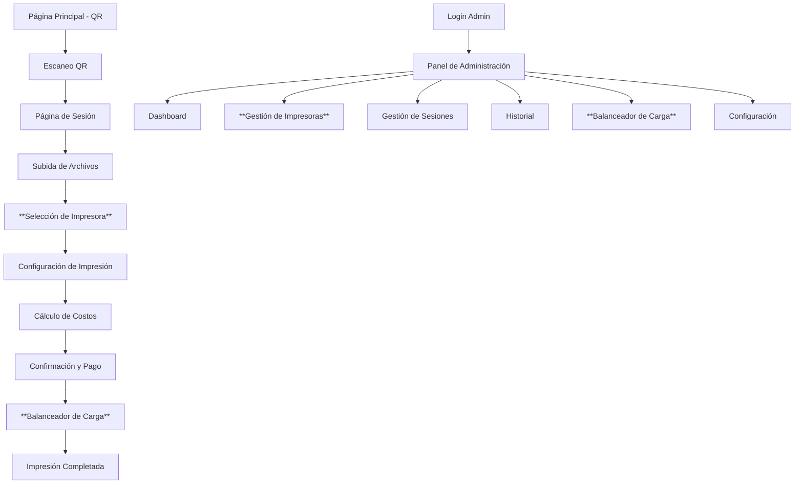

# PRD - Imprimeindo: Sistema de Impresiones Inteligente Multi-Impresora

## 1. Product Overview

**Imprimeindo** es un sistema web desarrollado en Laravel que funciona como una máquina expendedora de impresiones inteligente **multi-impresora**, permitiendo a los usuarios conectarse vía Wi-Fi, subir archivos PDF/DOCX, seleccionar entre múltiples impresoras disponibles, configurar parámetros de impresión y obtener impresiones físicas de manera automatizada con balanceador de carga.

El sistema está diseñado para entornos como universidades, bibliotecas o centros de copiado de gran escala, donde múltiples impresoras operan simultáneamente para atender alta demanda de usuarios que necesitan imprimir documentos de forma rápida y eficiente sin necesidad de instalaciones complejas en sus dispositivos.

El producto busca revolucionar el proceso tradicional de impresión, eliminando la necesidad de drivers locales, proporcionando una experiencia completamente web-based con **gestión inteligente de múltiples impresoras** y control administrativo centralizado con sistema de colores unificado.

## 2. Core Features

### 2.1 User Roles

| Role | Registration Method | Core Permissions |
|------|---------------------|------------------|
| Usuario Temporal | Escaneo de código QR generado por el sistema | Puede subir archivos, **seleccionar impresora disponible**, configurar impresión, ver costos y confirmar trabajos de impresión |
| Administrador | Credenciales predefinidas en el sistema | Control total del sistema, **gestión de múltiples impresoras**, acceso a estadísticas, gestión de sesiones, configuración de precios y monitoreo completo del parque de impresoras |

### 2.2 Feature Module

Nuestro sistema de impresiones inteligente multi-impresora consta de las siguientes páginas principales:

1. **Página Principal**: Generación y visualización de código QR, información del sistema, **estado de múltiples impresoras en tiempo real**.
2. **Página de Sesión de Usuario**: Subida de archivos múltiples, validación de formatos, vista previa de documentos, **selector de impresora disponible**.
3. **Página de Configuración de Impresión**: **Selección de impresora específica**, selección de tipo de impresión (color/B&N), rango de páginas, número de copias, cálculo automático de costos por impresora.
4. **Página de Confirmación y Pago**: Resumen detallado de costos, **confirmación de impresora asignada**, confirmación de impresión, procesamiento del trabajo.
5. **Panel de Administración**: Dashboard con estadísticas, **gestión completa del parque de impresoras**, gestión de sesiones activas, historial de impresiones, configuración del sistema.
6. **Página de Login Administrativo**: Autenticación segura para administradores del sistema.
7. **Panel de Gestión de Impresoras**: **Nueva página** para administrar múltiples impresoras, configurar balanceador de carga, monitorear estado individual.

### 2.3 Page Details

| Page Name | Module Name | Feature description |
|-----------|-------------|---------------------|
| Página Principal | Generador QR | Genera códigos QR únicos para cada sesión, muestra estado del sistema y información básica |
| Página Principal | **Monitor Multi-Impresora** | **Muestra estado en tiempo real de todas las impresoras conectadas, disponibilidad, cola de trabajos** |
| Página de Sesión | Gestor de Archivos | Permite subida múltiple de archivos PDF/DOCX, validación de formatos, vista previa de contenido |
| Página de Sesión | **Selector de Impresora** | **Permite al usuario seleccionar entre impresoras disponibles, muestra capacidades de cada una** |
| Página de Sesión | Validador de Sesión | Verifica validez de sesión QR, controla tiempo de expiración, mantiene estado de usuario |
| Configuración Impresión | Selector de Opciones | Permite elegir tipo impresión (color/B&N), definir rango de páginas, establecer número de copias |
| Configuración Impresión | **Configurador por Impresora** | **Ajusta opciones específicas según capacidades de la impresora seleccionada** |
| Configuración Impresión | Calculador de Costos | Calcula automáticamente costos en pesos mexicanos basado en configuración y impresora seleccionada |
| Confirmación y Pago | Resumen de Trabajo | Muestra detalles completos del trabajo de impresión, costos desglosados, **impresora asignada**, archivos a imprimir |
| Confirmación y Pago | **Procesador Multi-Impresora** | **Envía trabajo a impresora específica con balanceador de carga, monitorea estado, elimina archivos post-impresión** |
| Panel Admin | Dashboard Estadísticas | Visualiza impresiones realizadas, sesiones creadas, ingresos generados, **estadísticas por impresora**, uso del sistema |
| Panel Admin | **Gestor de Impresoras** | **Lista todas las impresoras, permite agregar/quitar, configurar parámetros, monitorear estado individual** |
| Panel Admin | Gestor de Sesiones | Lista sesiones activas, permite cancelar sesiones, limpia sesiones expiradas |
| Panel Admin | Historial Impresiones | Muestra historial completo de trabajos, **filtrado por impresora**, permite reimpresión, exporta reportes |
| Panel Admin | **Balanceador de Carga** | **Configura algoritmos de distribución de trabajos, prioridades por impresora, mantenimiento programado** |
| Panel Admin | Configuración Sistema | Permite modificar precios, **configurar múltiples impresoras**, ajustar parámetros del sistema |
| Login Administrativo | Autenticación | Valida credenciales de administrador, establece sesión segura, redirige a panel |

## 3. Core Process

### Flujo de Usuario Regular

El usuario inicia escaneando el código QR mostrado en la pantalla principal del sistema, lo cual lo dirige a una URL única de sesión temporal. Una vez en la interfaz web, puede subir uno o varios archivos PDF o DOCX mediante drag-and-drop o selección manual. El sistema valida automáticamente los formatos y muestra una vista previa de los documentos.

**[NUEVO]** El sistema presenta una lista de impresoras disponibles con sus capacidades (color/B&N, velocidad, cola actual). El usuario selecciona la impresora preferida o permite que el sistema asigne automáticamente la más eficiente.

Posteriormente, el usuario configura los parámetros de impresión adaptados a la impresora seleccionada: selecciona entre impresión a color o blanco y negro (según capacidades), define el rango de páginas específico o selecciona todas, y establece el número de copias deseadas. El sistema calcula automáticamente el costo total en pesos mexicanos considerando las tarifas específicas de la impresora seleccionada.

Finalmente, el usuario revisa el resumen completo del trabajo incluyendo la impresora asignada, confirma la impresión y el sistema procesa automáticamente el trabajo enviándolo a la impresora específica mediante el balanceador de carga. Una vez completada la impresión, todos los archivos se eliminan automáticamente del sistema.

### Flujo de Administrador

El administrador accede al sistema mediante credenciales seguras en la ruta /admin/login. Una vez autenticado, puede monitorear en tiempo real las estadísticas del sistema, incluyendo número de impresiones por impresora, sesiones activas e ingresos generados por dispositivo.

**[NUEVO]** Desde el panel puede gestionar el parque completo de impresoras: agregar nuevas impresoras, configurar parámetros individuales, establecer prioridades de balanceador de carga, programar mantenimientos y monitorear el estado en tiempo real de cada dispositivo.

Desde el panel puede gestionar sesiones activas, cancelar trabajos en proceso, revisar el historial completo de impresiones filtrado por impresora, y configurar parámetros del sistema como precios por página por tipo de impresora, tiempo de expiración de sesiones y algoritmos de distribución de carga.

## 4. User Interface Design

### 4.1 Design Style

**[NUEVO] Sistema de Colores Centralizado:**
- **Archivo de Variables**: Todos los colores se definirán en un archivo CSS/SCSS centralizado (`resources/css/variables.css`)
- **Variables CSS Principales**:
  - `--primary-blue: #2563eb` (Azul corporativo)
  - `--success-green: #16a34a` (Verde éxito)
  - `--neutral-gray: #6b7280` (Gris neutro)
  - `--pure-white: #ffffff` (Blanco)
  - `--alert-red: #dc2626` (Rojo alerta)
  - `--printer-online: #10b981` (Verde impresora activa)
  - `--printer-offline: #f59e0b` (Amarillo impresora inactiva)
  - `--printer-error: #ef4444` (Rojo error impresora)

- **Estilo de Botones**: Botones redondeados con esquinas suaves (border-radius: 8px), efectos hover suaves usando variables CSS
- **Tipografía**: Inter o system fonts, tamaños: 14px (texto), 18px (subtítulos), 24px (títulos)
- **Estilo de Layout**: Diseño tipo card con sombras suaves, navegación superior fija, espaciado generoso
- **Iconos**: Iconos minimalistas estilo Heroicons, emojis para elementos visuales (🖨️, 📄, ⚙️, 🔄)

### 4.2 Page Design Overview

| Page Name | Module Name | UI Elements |
|-----------|-------------|-------------|
| Página Principal | Generador QR | Card central con QR code grande, fondo gradiente usando `var(--primary-blue)` y `var(--pure-white)`, botón de actualización, **grid de estado de impresoras con colores variables** |
| Página Principal | **Monitor Multi-Impresora** | **Cards individuales por impresora con indicadores de estado usando `var(--printer-online)`, `var(--printer-offline)`, `var(--printer-error)`** |
| Página de Sesión | **Selector de Impresora** | **Lista de impresoras disponibles con cards, indicadores de capacidad, botones de selección con colores variables** |
| Página de Sesión | Gestor de Archivos | Zona de drag-and-drop con bordes punteados, lista de archivos con iconos, botones de eliminación usando `var(--alert-red)` |
| Configuración Impresión | **Configurador por Impresora** | **Opciones dinámicas según impresora, toggles con colores específicos, preview adaptado** |
| Configuración Impresión | Selector de Opciones | Toggle switches para color/B&N, input numérico para páginas, slider para copias, preview en tiempo real |
| Confirmación y Pago | Resumen de Trabajo | Tabla detallada con bordes, **información de impresora asignada**, totales destacados usando `var(--success-green)`, botón de confirmación usando `var(--primary-blue)` |
| Panel Admin | **Gestión de Impresoras** | **Grid de impresoras con cards de estado, botones de acción, modal de configuración, indicadores en tiempo real** |
| Panel Admin | Dashboard | Cards con estadísticas, **gráficos por impresora**, colores diferenciados usando variables CSS, layout en grid responsivo |

### 4.3 Responsiveness

El sistema está diseñado con enfoque mobile-first, adaptándose automáticamente a dispositivos móviles, tablets y desktop. Se optimiza especialmente para tablets ya que es el formato más común en puntos de impresión públicos. **[NUEVO]** Incluye vistas adaptativas para la gestión de múltiples impresoras en dispositivos pequeños con scroll horizontal y cards colapsables. Incluye optimización para interacciones táctiles con botones de tamaño adecuado (mínimo 44px) y gestos intuitivos como drag-and-drop para subida de archivos.

**Sistema de Variables CSS Responsivo:**
- Breakpoints definidos en variables CSS para consistencia
- Tamaños de fuente y espaciado adaptativos usando variables
- Colores que se mantienen consistentes en todos los dispositivos